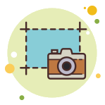
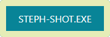
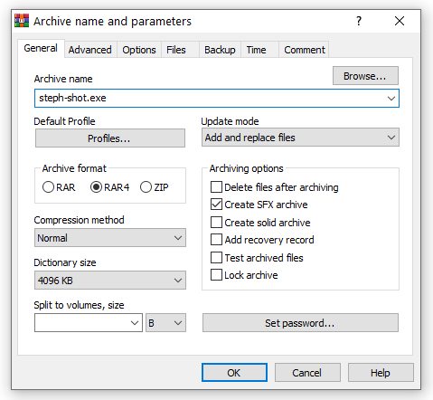
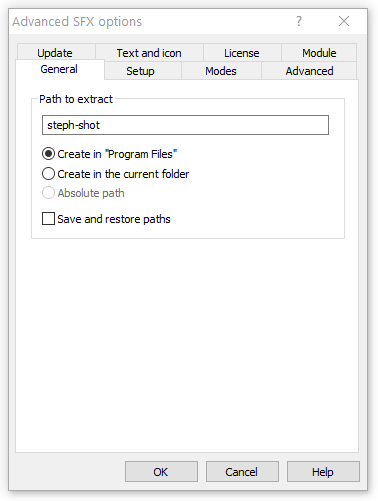
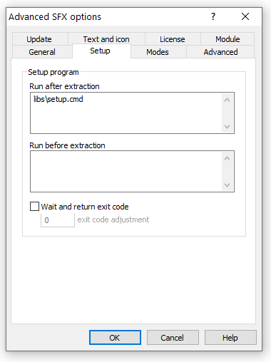
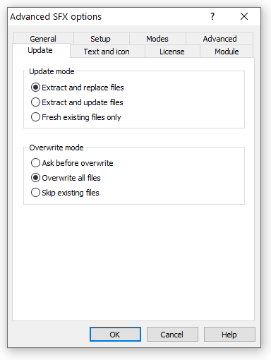
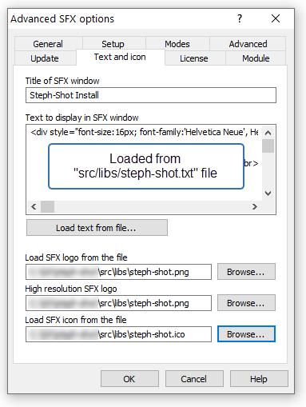

<h1 style="color:#088497;">Steph-Shot</h1>

<strong>Steph-Shot</strong> allows you to quickly save a screen shot to disk and copy it to your clipboard (Windows OS required).  

Once installed, a shortcut will be added to your desktop and by default can be launched by pressing <strong>"Ctrl + Shift + A"</strong> on your keyboard.

All screen shots are automatically saved to your Downloads directory in a folder named <strong><i>"Steph-Shots"</i></strong>.  Additionally, the screen shot is also saved to your clipboard and ready to be pasted if needed.  Happy <i>Steph-Shotting</i> 📸

---

### _Install Note_
If a shortcut for steph-shot isn't created on your Desktop, you will need to manually run the `setup.cmd` from the `libs` folder in the target install directory. The default install location is:  
`C:\Program Files (x86)\steph-shot`

 
 

---

#### Download the latest version here

 
 

---

 
 

### Packaging
_information only_  

Here is info on how the `steph-shots` installer is currently built from source. `steph-shot` is packaged as an `sfx` file using `winrar` with the following options:

 
 
 
 
 
